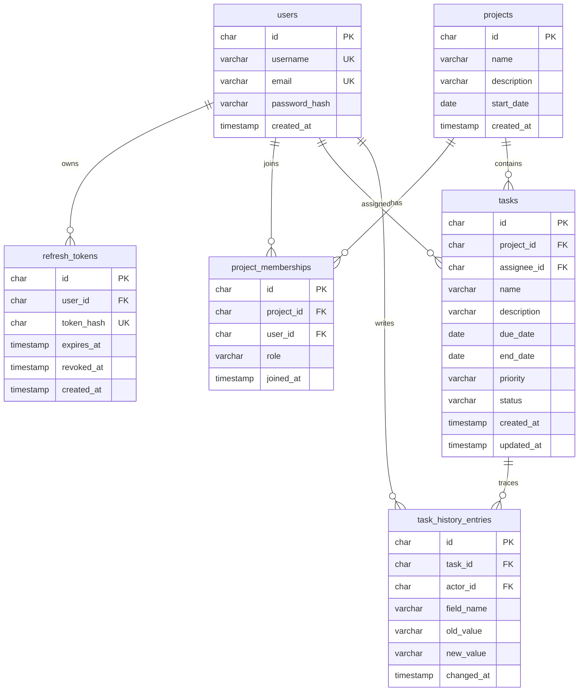

# Schéma de base de données

```mermaid
erDiagram
  users ||--o{ refresh_tokens : owns
  users ||--o{ project_memberships : joins
  projects ||--o{ project_memberships : has
  projects ||--o{ tasks : contains
  users ||--o{ tasks : assigned
  tasks ||--o{ task_history_entries : traces
  users ||--o{ task_history_entries : writes

  users {
    char id PK
    varchar username UK
    varchar email UK
    varchar password_hash
    timestamp created_at
  }

  refresh_tokens {
    char id PK
    char user_id FK
    char token_hash UK
    timestamp expires_at
    timestamp revoked_at
    timestamp created_at
  }

  projects {
    char id PK
    varchar name
    varchar description
    date start_date
    timestamp created_at
  }

  project_memberships {
    char id PK
    char project_id FK
    char user_id FK
    varchar role
    timestamp joined_at
  }

  tasks {
    char id PK
    char project_id FK
    char assignee_id FK
    varchar name
    varchar description
    date due_date
    date end_date
    varchar priority
    varchar status
    timestamp created_at
    timestamp updated_at
  }

  task_history_entries {
    char id PK
    char task_id FK
    char actor_id FK
    varchar field_name
    varchar old_value
    varchar new_value
    timestamp changed_at
  }
```
